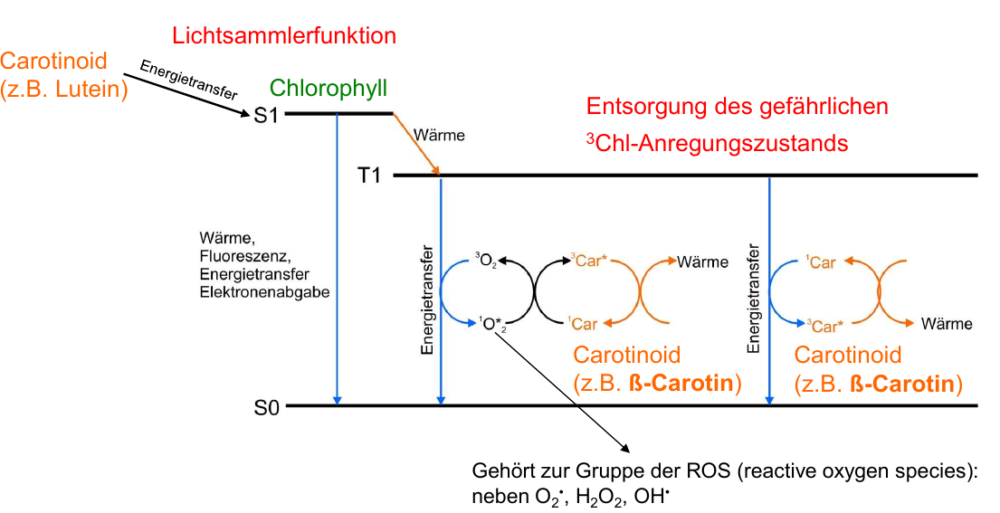

```{r, echo=FALSE}
library(knitr)
```

> Written and answered on a best effort basis. It might contain wrong answers.
> Copying without questioning leads to your ruin!


# 1. Chloroplasten “Erinnerung und update“

### Aufbau und Aufgaben Chloroplast

```{r, fig.cap = "Aufbau eines Chloroplasten", echo=FALSE, out.width="75%"}
knitr::include_graphics("media/lecture1_chloroplast.png")

```

* Semiautonomes Organell
  + DNA
  + Proteinbiosynthese
  + Vermehrung durch Teilung

* Aufgaben
  + Energiestoffwechsel (Photosynthese)
  + Biosynthese u.a von Chlorophyllen, Fettsäuren, Carotinoiden
  + Nitrit- und Sulfatreduktion

### DNA der Chloroplasten (cpDNA)
* zirkuläre ds-DNA
* keine Histone &rarr; prokaryotische Abstammung
* kein 5'-Methylcytosin

> Welche bakteriellen Eigenschaften der plastidären DNA gibt es? Nennen sie drei Merkmale

* Genetisches System mit ~ 120 Genen &rarr; Gene aus ursprünglichem Genom in Kern verlagert worden
  + rRNA, tRNA
  + ribosomale Proteine, Untereinheiten der RNA-Polymerase
  + Translations- und Elongationsfaktoren
  + Untereinheiten von Proteinen der Thylakoidmembran &rarr; Photosynthese
  + mehrere Plastome pro Chloroplast &rarr; mehrfache Kopien der cpDNA pro Zelle (10% des Genoms)

* Organistion der plastidären DNA
  + Gegenstrangkodierung und Organisation in Operons
  + Aufteilung &rarr; je nach Gattung/Art unterschiedliche Größen aber Grundschema gleich
    + SSC &rarr;  small single copy region
    + LSC &rarr;  large single copy region
    + Inverted Repeats &rarr; unterbricht/flankiert SSC

* Codiert Housekeeping & Photosynthese Gene &rarr; jedoch nicht alle
  + siehe psb- Gene die kernkodiert sind
  + Durchgängig, bedeutet bei Viridiplantae, Grünalgen und Heterokontae
  + Auslagerung realtiv früh &rarr; alle Proteinkomplexe zeigen diese Aufspaltung in Kern- und Plastid

> Wie ist die Genanordnung?

```{r, fig.cap = "Aufbau plastidärer DNA", out.width = "49%", fig.show = "hold", echo=FALSE}
knitr::include_graphics("media/lecture1_dna_struktur.png")

```

### Apikoplasten

* Chloroplasten ähnliche Kompartimente in parasitischen Protisten
  + z.B. Toxoplasmose

* Umgeben von 4 Hüllmembranen

* Genome gleicht dem Chloroplastengenome
  + rRNA, tRNA und Proteingene
  + Weisen Inverted Repeats, SSC (kaum existent) und LSC auf

* phagocytierte Algen, deren Chloroplasten von photosynthetischen Bakterien abstammen

* Endosymbionten &rarr; Kompartimente &rarr; keine photosynthetische Aktivität mehr


### Transkription & Translation

* DNA ist prokaryotisch
  + Prokaryotische Polymerasen, Promotoren und Ribosomen
  + Operonstruktur

* Weist jedoch Introns und RNA-editing auf

* Transkription &rarr; zwei Polymerasen

  1. PEP (plastid encoded RNA polymerase)
      + plastidenkodiert &rarr; Transkription plastidenspezifischer Proteine
  2. NEP (nuclear encoded RNA polymerse)
      + homolog zur Bakteriophagen-Polymerase
      + Transkription von "Housekeeping" Genen

* Bakterielle Promotoren für PEP Polymerasen
  + -35 &rarr; TATA-Box &rarr; -10 Elemente
  
* Editing Stellen &rarr; sehr variabel bzw. noch unbekannt
  + Beispiel Black pine/Schwarzkiefer ORF 62b
  + Übersetzen der prä-mRNA würde Threonin, Serin und Glutamin an bestimmten Positionen enthalten sein
  + Editierung verändert Codons &rarr; z.B. Einführung eines Start- und Stopcodons
  + Kontrollstelle für Pflanze &rarr; aber aus Sequenz nicht ableitbar
  
* Regulation der Transkription
  + vermittelt durch Transkriptionsfaktoren &rarr; nucleär codiert
  + Aktivierung durch Rezeptoren (Licht, Hormone)
  
* Regulation der Translation
  + Umwelteinflüsse
  + Stoffwechselprodukte
  + Hormone &rarr; Wachstum der Zelle

* Beispiel: Translation plastidär codierter Proteine
  + Shine Dalgarno Sequenz erwartet, aber nicht überall ausgeprägt  
  &rarr; Ausgeprägte 5'-UTR mit sekundär RNA-Strukturen
  + Interaktion mit regulatorischen Proteinen (Kernkodiert)
  + Aktivierung durch reduzierten Komplex &rarr; Dephosphorylierung, Reduktion und Translation
    + Wechsel zwischen Reduktion und Oxidation
    
```{r, echo=FALSE, fig.cap="Translationskontrolle"}

```

### Transgene Pflanzen

* Nukleäre Transformation &rarr; Einbringen bzw. Veränderung am Genom im Kern (z. B. durch Floral Dip)
  + zusätzliche Gene
  + Knock-out durch zufälliges Einbringen von Resistenzkasetten &rarr; Variabilität/ Biblitoheken von Mutanten
  + Homozygotie durch Kreuzung &rarr; Polyploidie
  
  &rarr; Homologe Rekombination selten in Nukleus, daher entweder CrispR-Cas oder Transformation
  
* Chloroplastentransformation
  + Homologe Rekombination &rarr; Hauptreperaturmechanismus
  + Vorteile:
      + Direkter Ersatz von von Plastidgenen
      + Plastiden werden __maternal__ vererbt &rarr; kein Pollenflug
  + Nachteile:
      + Beeinträchtigung durch Gegenstrangkodierung & Operonstruktur
      + Ersetzen von plastidären Genen &rarr; Einschänkung durch geringe Anzahl
      + Langwierig, da Selektion von Homoplastischen Zellen mit Resistenzgenen
  + Voraussetzung:
      + Genom sequenziert &rarr; flankierende Bereiche müssen mit kloniert werden
      + Kallusstücken &rarr; ganze Pflanze

> Was für ein Vorteil hat die Transformation von Plastom im Vergleich zur nukleären Transformation?

* Resistenz gegen Herbizide, Frost, Schädlinge
* Produktion von Pflanzenstoffen, Proteinen

* Risiken der Freisetzung
  + Nukleäre Transformation
    + Verwilderung
    + Hybride &rarr; Ausbreitung des Fremdgenes über Pollen
    + __Vertikaler__ Gentransfer durch Kreuzung mit freilebenden Vorfahren
    + __Horizontaler__ Gentransfer durch Viren oder Bakterien &rarr; Genfähren z.B. Resistenzgen
    
  + Plastidäre Transformation
    + Viren/Bakterien als Genfähren
    + Verwilderung möglich
    + Ausbreitung der Gene über Samen

### Lokalisation der Proteine

* Proteine der Thylakoidmembran sowohl im Kern als auch im Plastiden codiert
  &rarr; Transport in Chloroplasten

* Assoziierung mit Membran, Lumen oder Stroma &rarr;

* Passagen um Zieldestination zu erreichen
  + __Envelope__ &rarr; Passierung äußere Membran des Chloroplasten

```{r, echo=FALSE, fig.cap="Transport nukleär codierter Proteine"}
knitr::include_graphics("media/lecture1_protein_import.png")
```

* Import nukleär codierter Proteine
  + Nukleus &rarr; Transkription
  + Cytoplasma &rarr; Translation an 80s Ribosomen
  + Precursor Polypeptide mit Signalsequenz &rarr; Transitpeptid (N-Terminus)
      + begleitet von _Chaperonen_ an Envelope
  + Transport über Tic/Toc-Komplex (energieabhängig) durch Envelope
      + Toc = äußere Membran
      + Tic = innere Membran
  + Thylakoidtransferdomäne &rarr; T. membran oder lumenale Proteine
  
```{r, echo=FALSE, fig.cap="Signalpeptide für Proteinimport"}

```

### Assemblierung / Transport von Proteinen des Chloroplasten

* plastidär
  + Stromale Proteine translatiert und adhesiert z.B. an Membran
  + Membranproteine &rarr; cotranslationale Insertion (Direkter Einbau in Membran)
  + Lumenales Protein &rarr; Thylakoidtransfer (zusätzliche Erkennungssequenz &rarr; Domäne benötigt)

* nukleär
  + Stromale Prtoeine &rarr; kein weiterer Transport
  + Membranproteine &rarr; Thylakoidmembraninsertion
  + Lumenales Protein &rarr; Thylakoidmembrantransfer

* Transport an/in Membran
  + 2 Mechanismen
      1. cpSRP (chloroplast signal recognition particle) &rarr; Energieabhängige Insertion mittels Proteinkomplexes
      2. "spontan" &rarr; Primärstruktur ermöglicht selbstständige Insertion (thermodynamisch)

* Transport über die Membran
  + Sec-Transporter (bakterieller Transportmechanismus)
      + ungefaltet durch Membran geschleust &rarr; ATP Verbrauch
  + Tat
      + Transport von bereits gefalteten Proteinen
      + pH Gradient muss bestehen bleiben
      
      
> Beschreiben Sie den Weg für die Fertigstellung der Untereinheit des LHCII, angefangen
mit dem Ort der Translation. 
> Wie gelangt das Protein vom Kern in die Thylakoidmembran? (Kennzeichnen sie die energieabhängigen Schritte und beschreiben Sie ebenso die Veränderung der Polypeptidkette in diesen Schritten

* Einbau der Cofaktoren
  + Einbau während Proteinfaltung &rarr; Chlorophylle, Carotinoide
      + Delegation zum richtigen Ort zum richtigen Zeitpunkt
  + Vor der Faltung z.B. Cytochrome heften lumenseitig an bevor gefaltet wird
  + Fe, S-Zentren werden stromaseitig eingebaut &rarr; vor Transport 
  
* GroEL-GroES Chaperone

### Assemblierung & Reperatur des PSII

* Assemblierung PSII 
  + Viele Untereinheiten benötigen "Reaktionskeime"
  + Reaktionszentrum besteht aus D1 & D2 und ihren Cofraktoren
  + D2 & D1 werden mit Cytochromen zusammengesetzt &rarr; Reaktionszentrum
    + weitere Schritte nach Baukastenprinzip
  + LHC &rarr; Lichtantennen (Minor LHC und LHC2 trimere)

* PSII Reperatur
  + D1 Protein ist empfindlich &rarr; Cofaktoren des Elektronentransportes gebunden
  + Auslastung &rarr; Chlorophylltriplets (single Sauerstoff) &rarr; Oxidation
  + Turnover rate ~ 30min
  + Protease verdaut/degradiert defektes D1 &rarr; Einbau eines neuen D1-Proteins
  + In Grana höherer Pflanzen wird D1 nicht so ersetzt


# 2. Regulation des Chloroplasten / Regulation durch Photorezeptoren

### Lichtregulation
* Warum wird Lichtregulation benötigt? Reduktionsequivalente/ATP der Photosynthese
  + Kohlenstoffreaktionen der Photosynthese (Calvin-Zyklus)
  + Nitratreduktion
  + Sulfatreduktion
  + Pigmentsynthese
  + Genexpression im Chloroplasten
  + Proteintranslation

* Stoffwechselwege benötigen Regulation & müssen bei Dunkelheit ausgestellt werden

* Signale im Chloroplasten
  * pH Gradient (Lumen (Ansäuerung) > Stroma, bei Licht)
    + starke Gegenströme von Mg2+ um dies auszugleichen
  * Reduktionsequivalente &rarr; NADPH & Fd~red~
  * ATP-Produktion

  
```{r, echo=FALSE, fig.cap="Regulationsparameter imm Chloroplasten"}

```


* Thioredoxine (2 zwei Cysteine für Oxidation &rarr; Cystin)
  + klein und ubiquitär vertreten
  + Tertiärstruktur und Redoxpotential bestimmen Substratspezifität
  + Oxidation = inaktive, Reduktion = aktiv
  + Reduziertes Ferredoxin (erstes Protein hinter PSI) &rarr; Reduktion von Thioredoxin (FTR)
  + Dieses kann __erneut__ ein entsprechendes Enzym reduzieren

```{r, echo=FALSE, fig.cap="Redoxregulation durch Thioredoxine"}

```


* Regulation mittels Ionen und pH-Wert
  + pH Abhängigkeiten der Enzyme
  + Beispiel: Fruktosebisphosphatase (Stroma)
    + Dunkel/wenig Licht &rarr; saurer pH im Stroma/wenig Mg2+, daher inaktiv
    + Licht &rarr; alkalischer pH mit viel Mg2+, daher aktiv

* Aktivierung RubisCo
  + Bei Anwesenheit von ATP (Licht): Aktivase entfernt CA1P Zucker, welches RubisCo voher gehemmt hat
  + Carbamylierung des aktiven Zentrum (COO-) &rarr; Komplexierung mit Mg &rarr; aktives RubisCO
  
* De-/Phosphorylierung
  + Phosphatasen unf Kinasen &rarr; PEP-Carboxylasen
  + ATP abhängig 

* Regulation von Stoffwechselwegen
  + Oxidativer und Reduktiver Pentosephosphatweg &rarr; gegeneinander reguliert, da sonst nur ATP verbraucht würde
  + meist __mehrere Faktoren__ an Regulation eines Prozesses beteiligt

> Welche lichtreduzierende Proteine gibt es?


### Interaktion des Chloroplasten mit anderen Kompartimenten

* Kohlenhydratstoffwechsel 
  + Stärkesynthese im Chloroplasten / Saccharosesynthese im Cytosol &rarr; Phosphat
  + 3-Phosphoglycerat = hauptsächlicher Metabolit
      + Regenration Ribulose-1,5-bisphosphat und Photorespiration &rarr; 1/8 steht zur Verfügung
      + mehr darf nicht und weniger kann nicht exportiert werden (P~i~ würde fehlen)
  
  + Triose-P/P~i~ Translokator (Antiporter)
    + Import von P~i~ für Triose-P / Kein Import wenn Saccharosesynthese nicht möglich
  
  + Synthesewege gegeinander reguliert
      + viel Triose-P & Saccharoseverbrauch &rarr; starke Saccharosesynthese
  + Verhältnis 3-Phosphoglycerat/P~i~ entscheidend ob Stärkesynthese stattfindet
      + Stärke ist unphosphoryliert
      + Stärke als Pool um Phosphatkonzentration aufrecht zu erhalten

```{r, echo=FALSE, fig.cap="Regulation Kohlenhydratstoffwechsel"}

```

* Nitratassimilation
  + Nitratreduktion in Cytosol &rarr; Nitrit
      + Nitrit im Chloroplasten weiterverabeitet &rarr; __starkes Oxidationsmittel__
  + Umwandlung zu Ammonium (auch toxisch) und anschließend zu AS
      + Reduktion nur dann wenn AS synthetisiert oder in Vakuole gespeichert
  + Abschalten im Dunkeln, da auf Produkte der Photosynthese angewiesen
  + Bereits das Gen für Reduktase stark reguliert (Glucose, Licht, Nitrat, Glutamin-Konzentation)
      + Nachregulation im Licht durch Phosphorylierung und Inhibitoren
  + Nitrat- und Nitritreduktion müssen abgestimmt sein
  + Nitrat- und CO~2~-Assimilation müssen abgestimmmt sein
      + Kohlenstoffgerüst der AS 
  + Nitrat und SO~4~-Assimilation müssen abgestimmt sein
      + AS mit Schwefelgruppen

```{r, echo=FALSE, fig.cap="Regulation Nitratstoffwechsel"}

```


### Genregulation („Crosstalk“ ) zwischen Kern und Chloroplasten

* Anterograde Signale
  + Regulation/Signal von __Kern &rarr; Plastid__
  + Auslöser z.B. Hormon- Photorezeptoren, circadiane Uhr
      + Phytochrome, Cryptochrome

* Retrograde Signale
  + Signal vom __Plastid &rarr; Kern__
  + Unterscheidung in biogene und operationale Signale
      + biogen = Information über Entwicklungszustand
      + operational = Photosynthese und Metabolismus
  + Beispiele
      + Chlorophyll Zwischenstufen &rarr; Expression von Genen
      + Plastidäre Genexpression
      + Redox Signale

* Beispiel biogenes Signal
  + Synthese/Assemblierung des PSII
      + Koordination der Genexpression in zwei Organellen
      + PSII Untereinheiten (plastidär), LHC (kernkodiert)
      + Chlorophyll Pignmentsynthese
  + ohne D1 Synthese &rarr; GUN1 (Signalpeptid) hemmt LHCII Synthese im Kern über PTM Weg
  + GUN1, Heme und Mg-Protoporphyrin IX sind Signale in den Kern

* PHANGs: Photosynthesis associated nuclear genes (z. B. LHC)

* PGE: Plastid gene expression (z. B. Photosystem Untereinheiten)

```{r, echo=FALSE, fig.cap="Regulation LHC und PS Assemblierung"}

```


### Regulation durch Photorezeptoren

* Photorezeptoren decken gesamtes Lichtspektrum ab
  + zelluläre Änderung wie Transkription, Membranpotentialänderung
  + Antworten auf Umwelt und Entwicklung

* URV8 &rarr; UV-Licht Rezeptor
  + Domäne 8-fach vorhanden
  + kein Chromophor &rarr; Photorezeption durch Tryptophan
  + photomorphogenetische Reaktionen
  + Dimer im Dunkeln &rarr; Absorption führt zur Monomerisierung
      + COP1 &rarr; Genregulation
  
* Phytochrome &rarr; Rotlichtrezeptor
  + Tetrapyrol als chromophore Gruppe (Phytochromobilin)
  + Kernimportdomäne
  + Absorption von hellrotem Licht &rarr; __aktive Form Pfr__
    + bindet Transkriptionsfaktoren &rarr; __Genregulation__
    + Regulation von Phangs z.B LHCII
  + Absorption von dunkelrotem Licht &rarr; __inaktive Form Pr__
  + Zentrale Rolle bei Entwicklungsprozessen
      1. Klasse 1 (instabil in far-red): phyA
      2. Klasse 2 (stabil, reversibel: phy{B..E}

* LOV (Light/Oxygen/Voltage) Sensoren &rarr; Blaulichtrezeptoren
  + Falvin-Chromophore (FAD,FMN) &rarr; Aromaten
  + Phototropine (phot1/phot2)
      + Membranproteine
      + LOV- und Effektordomäne
  + physiologische Reaktion z.B. Änderung Membranpotenzial durch Einfluss auf Transporter


* Cryptochrome &rarr; Blaulichtrezeptoren
  + Cryptochrom/Photolyase Familie (löslich)
      + PHS (Photolyase Homologue Region) und CCT am C-Terminus
      + Photolyase = Reperaturenzyme für DNA nach UV-Schäden
      + Genexpression indem nach Lichtperzeption mit COP1 interagiert wird  (Cry1/Cry2)  
      &rarr; verhindert Abbau von TF  
  + Binden FAD im PHS
  + zusätzlich noch ein anderes Pigment &rarr; Antennenchromophor
  + MTHF als Antennenchromophor 
    + FADH° radikal welches im Dunkeln zu FAD~ox~ oxidiert
    
    
  + Cryptochrome
      + FAD~ox~ &rarr; Grundzustand
      + Blaulicht &rarr; Signalzustand (Aufnahme Elektron)
      + Protonierung zu FADH° &rarr; Konformationsänderung und damit ein Signal
  + Photolyasen
      + FADH° semi-radiakal im Grundzustand
      + FADH^-^ zur Reperatur der DNA
      
    
# 3. Lichtschutz bei der Photosynthese

* Anpassung an unterschiedliche Lichtsituationen
  + Unterschiede in __Lichtintensität__, __Lichtqualität__

* Sensorik für Anpassung
  + Photorezeptoren (Lichtmenge und qualität)  
  &rarr; Dienen hauptsächlich zur Regulation der Transkription und Translation  

  + Photosynthese
    + Photorezeptoren wären zu langsam um Anpassung vorzunehmen
    + Verschiedene Faktoren?/Merkmale zur Regulation
      + pH Gradient der an Thylakoidmembran aufgebaut wird
      + Redoxzustand des Plastochinon (hinter PSII)
      + Konzentration NADH (Redoxäquivalente)
      + Redoxstress &rarr; singulärer Sauerstoff, wenn Photosynthese ausgelastet
      + Metabolite (ATP, NADPH, ...)

* Anpassungsmechanismen
  + PQ &rarr; state transition von PSI & PSII
  + $\Delta$pH &rarr; NPQ
  
> Wie entstehen Anregungsunterschiede zwischen dem Photosystem II und I?
  
## Regulation der Lichtsammlung und Lichtschutz

  * State Transitions &rarr; Ausbalancierung von Lichtsammlung PSI & PSII
    * Verschiebung Lichtqualität verändert Balance (Lichtzusammensetzung)
  * Hohe Lichtenergie
    + zu viel Energie, die die Photosynthese nicht verarbeiten kann
    + Nichtphotochemischer Energieabbau &rarr; NPC

* State transitions
  * Kinase/Phosphatase-abhängige LHCII-Wanderung
  * Herstellen einer Balance durch "verschieben" der Lichtantennen an das jeweils
    weniger angeregte PS
  
  * PSII-Überanregung (State 2)
    + Plastochinon wird stark reduziert &rarr; Zug am PSI zu gering bzw. Elektronen können nicht abfließen
    + Stn7-Kinase phosphoryliert LHCII und __"wandert" an PSI__
    &rarr; PSI mehr Anregunsenergie durch relativ größere Lichtantenne
  
  * PSI-Überanregung (State 1)
    + TAP38 dephosphoryliert LHCII &rarr; oxidierter Plastochinon-Pool
    + Umgekehrter Prozess zu PSII Überanregung
  
  * __Plastochinon-Pool bzw. dessen Redoxzustand ist der Sensor__ 
    + Reduzierter Pool &rarr; STN7-Kinase
    + Oxidierter Pool &rarr; TAP38
  
  * Theoretisch: Verteilung der Anregungsenergie durch Antennenwanderung

```{r, echo=FALSE, fig.cap="Vereinfachtes theoretisches Model der State Transitions"}

```

> Wie wird relatives Anregungslicht in Bezug auf Anregungsunterschiede reguliert ?


* Nachweise der State Transitions
  * Welche Antennenkomplexe wandern? Wie viele? Wie schnell?
  
  * Western Blot Analyse
      + Nachweis der Phosphorylierung von LHCII (WT, Knockout Stn7, komplementiert Stn7)
  + Messung der Fluoreszenzemission als Maß für die Energieverteilung
      + Charakteristische Peaks der PS mit ihren LHCs &rarr; Unterschiedung der Photosysteme möglich
      + State2 &rarr; Emission realtiv an PSI höher als in State 1
      + Energie an PSI gestiegen, PSII gefallen oder beides  
      __&rarr; Umverteilung der Anregungsenergie__
  * Blue-native PAGE &rarr; Auftrennung PSI-LHCI -LHCII Komplexe &rarr; PSI bildet mit LHCI und LHCII einen Komplex
  
* Strukturbestimmung des PSI-LHCI-LHCII Komplexes
  + Isolation aus Thylakoidmembran und Single Particle Analysis
  + State 2 Erwartung
      + PSII mit und ohne LHCII, sowie freies LHCII
      + PSI-LHCI mit und ohne LHCII  
  __&rarr; LHCII als Trimer an PSI angelagert__
  
* PSI-LHCI-LHCII Komplex

  * LHCII kommt bei PSI an, aber was verliert PSII?
  * LHCII aus 3 Proteinen aufgebaut (Lhcb{1,2,3})
    + LHC trimere bestehen aus unterschiedlichen Kombinationen der Untereinheiten
    + PSI-LHCII weißt Kombination aus Lhcb1 und 2 auf &rarr; LHCII Trimer-S (strongly an PSII gebunden)
        + __entgegen der Erwartung, da Trimer-S immer an PSII gebunden__
        + __Mobiler LHCII des PSII kommt nicht bei PSI an__

```{r, echo=FALSE, fig.cap="Der PSI-LHCI-LHCII Superkomplex"}

```
     
* Angepasstes Modell
  * Plastochinon-Pool &rarr; Stn7 Kinase (Phosphorylierung)
  * PSI und PSII besitzen __eigenen Pool__ an LHCII
      + Freies LHCII in Gelelektrophorese
  * State transition 1 &rarr; 2
      + Phosphorylierung des LHCII an PSII
      + Loosely bound werden von PSII entfernt
      + Bindung an PSI nach Phosphorylierung (aus Pool des PSI)
  * State transition 2 &rarr; 1
      + Dephosphorylierung &rarr; vize versa
  
  * Freies LHCII muss gequencht werden
      + Würde sonst Floureszieren und die Antennengröße nicht geändert (Reabsorption benachbarter Pigmente)
  * Proteine, Kinase & Phosphatase an Substrat?


```{r, echo=FALSE, fig.cap="Erweitertes state transition Modell"}

```

## Lichtschutz
* nicht auf molekulare Ebene zu steuern
* effektive Photosynthese und photo-oxidativer Schäden (Balance)  
__&rarr; überschüssige Anregungsenergie als Wärme abgeben (NPQ)__
  
* Angeregte Chlorophylle &rarr; Grundzustand
    + Fluoreszenz
    + Photochemie
    + Wärme (NPQ)
    + Triplet Zustnd &rarr; Singulet-Sauerstoff!
    
```{r, echo=FALSE, fig.cap="Mögliche Wege der Energie"}

```

* Carotinoide - $\beta$-Carotin
  * Lichtsammler & Schutzfunktion
  * Lokalisiert in Reaktionszentren und inneren Antennen der Photosysteme
  * direkte Entsorgung von Triplett-Chlorophyll oder Singluet-Sauerstoff
    1. Energie direkt von Chlorophyll übernehmen (schnell) &rarr; Wärmeabgabe
    2. Energie von Singulet-Sauerstoff übernehmen &rarr; Wärmeabgabe

```{r, echo=FALSE, fig.cap="Entsorung überschüssiger Energie durch $\\beta$ Carotin"}

```

### NPQ
* Maß für Wärme-Dissipation
* PAM Fluoreszenz-Messung &rarr; Quenching Analyse
    + Blatt (dunkel adaptiert) 
    + belichtet mit starkem Blitz sehr kurz &rarr; alle PSII fluoreszieren maximal
    + Anregendes Licht &rarr; Photosynthese &rarr; steady state
    + Erneuter Blitz erreicht nicht mehr Maximum &rarr; Quenching 
  
* Anteile Energie die in Photochemie oder Wärme-Dissipation

* Korrelation mit anderen Daten (__Xanthophyllzyklus__):
    + __Zeaxanthin steigt mit NPQ__
    + __Violaxanthin fällt mit NPQ__
* Zeaxanthin, Violaxanthin in LHCII und inneren Antennen des PSII sowie LHCI
* Violaxanthin &rarr; De-epoxidase &rarr; Zeaxanthin
    + Vorgang in LHCII ungeklärt (Flip-Flop, Raus und wieder rein)

* Gear-shift Modell
    + Zeaxanthin in Lösungsmittel &rarr; kann Energie von Chlorophyll a übernehmen
    + Violaxanthin dient als Lichtsammler &rarr; überträgt Energie auf Chlorophyll a
    + Energielevel im Protein stimmen nicht mit denen im Lösungsmittel überein  
    &rarr; Theorie unbestätigt

* Carotenoid Kation Radikal in Thylakoidmembran unter NPQ
    + __Zeaxanthin als Radikal in isolierten LHCII nicht nachweisbar__
    + __Radikal in minoren LHCs nachweisbar__
        + CP29 in L2-Seite (Leutein-Bindestelle)
        + Xanthophylle &rarr; De-epoxidiert unter NPQ

* _In-vivo_ Experimente mit Mutanten
  + __Knockout von CP24, Cp29 führt zu NPQ Reduktion__
  + __CP24-CP29-LHCII Superkomplex (Minore + Trimer)__
      + lhcb3 Knockout führt nicht zu NPQ-Reduktion, aber Teil des Superkomplexes
      + __Auftreten korreliert mit NPQ &rarr; Benötigt__

* __Aggregation der LHCs (lateral in Membran) &rarr; selbständig gequencht__
  + 2 Zustände &rarr; "gequencht" und fluoreszierend
  + Kristalle (koordinierte Aggregation) &rarr; stärker gequencht
  + __Neoxanthin "twisted" &rarr; schiebt Lutein in eine andere Konfiguration__
      + __Abstand zum Chlorophyll verringert &rarr; übernimmt Energie__
      + normale Zustand &rarr; Energietransfer  
  __&rarr; Molekularer Schalter (Konformationsänderung) mit Lutein als Quencher__

* PsbS (Dimer)
  * Protonierbar auf lumenaler Seite 
  * gehört zu selber Proteinfamilie wie LHC
  * Konformationsänderung im Dimer abhängig von pH  
    __&rarr; könnte lumenalen pH registrieren__
  * Modell 1
      + psbS hilft beim Stacking der Thylakoidmembranen
      + LHC Assoziation an PSII  
      &rarr; unprotoniert
      + Bei protonierter Form &rarr; __Dissoziation und damit NPQ__
  * Modell 2 (saurer Zustand)
      + __LHCII-psbS Komplex &rarr; NPQ__
      + __Zeaxanthin &rarr; stärkeres NPQ__

* NPQ beruht nicht auf einer einzigen molekularen Ursache  
  &rarr; Lichtintensität und pH lösen verschiedene Reaktionen aus  
  + Geschieht auf Level der minoren Antennen zusammen im LHCII
  + psbS in Zusammenspiel mit LHCII
  + Einfluss auf Zeaxanthin
  &rarr; Zusammenspiel notwendig aber unverstanden


# 4.Diversität photosynthetischer Organismen/LHC


* Thylakoid = Einheit von zwei Membranen die ein Lumen umschließen

* Thylakoidmembransystem lässt sich in
  + Grana (enge Stapel von Thylakoiden)
  + Stroma-Thylakoide (einzelne Thylakoide, also 2 Mebranen) einteilen

* Diversität in der Thylakoidstruktur
  + Einzelthylakoide – Cyanophceae, Rhodophyceae (Rotalgen)
      + Phycobilisome aufgelagert
  + Grana/Stromathylakoide - Spermatophyta (streng genommen nur in höheren Pflanzen, aber hier auch Grünalgen)
  + Thylakoide in 3er Bändern - Heterokontophyta (Braunalgen)
      + Gürtellamelle am Rand

## Ursachen/Endosymbiosen
  
+ Chloroplasten in primärer Endosymbiose entstanden
    + plastidenloser Eukaryot + Cyanobakterium = photosynthetisch aktiver Eukaryot
    + Cyanobakterien (Photosynthese, Membrankomposition ähnlich, Komponenten des linearen Elektronentransports)
    + Glaucophyta, Rhodophyta und Viridiplantae  

```{r, echo=FALSE, fig.align='center',fig.cap="Primäre Endosymbiose der Chloroplasten"}
knitr::include_graphics("media/lecture4_primaere_endosymbiose.png")
```

+ Entwicklung komplexer Plastiden (3 oder 4 Hüllmembranen)
    + sekundäre Endosymbiose einer eukaryotischen Alge
    + plastidenloser + plastidenhaltiger Eukaryot = Eukaryot mit komplexen Plastiden
    + Bei Rotalgen (Oomyceten) sowie Viridiplantae/Grünalgen mehrfach geschehen

```{r, echo=FALSE, fig.align='center',fig.cap="Sekundäre Endosymbiose der komplexen Chloroplasten"}

```

* Chloroplasten mit 3-4 Hüllmebranen
  + 1 Membran = Phagosomale Membrane &rarr; angeschlossen raues ER des Kerns
  + Host-EM Lumen &rarr; Plastid hat ER
  + 2 Membran = Symbionten Plasmamembran (bei einigen Arten verloren)
  + PPC (periplastidisches Kompartement) &rarr; Symbionten Cytosol mit Nukleomorph (falls vorhanden)
  + 3-4 Membran = Envelope Mebranen des Symbionten Chloroplasten


* Nukleomorph = Kernähnliches Konstrukt (Relikt aus sekundärer Endosymbiose)
  + aktive Genexpression &rarr; eukaryotische Ribosomen in PPC

* Dinophyta &rarr; Funktion zur tertiärer Endosymbiose
  + Verlust des sekundären Endosymbionten und Aufnahme z.B. Diatomeen  
      __&rarr; sowohl Peridinin als auch Fucoxanthin als akzessorische Pigmente__
  + Endosymbionte in Korallen

* Kleptoplastidie
  + kurzzeitige Aufnahme des Endosymbionten &rarr; kein Verdau
  + "Symbiont" geht Funktion nach (produziert Sauerstoff und CO~2~)  
  &rarr; keine stabile Integration
  
* Voraussetzung für stabile Endosymbiose
  + Wirt darf Endosymbiont nicht verdauen
  + Gentransfer von Endosymbiont zum Wirt
  + Regulation der Kompartimente
  + Transport wird etabliert (Glukose für Zelle und Proteine für Chloroplast)

## Nachweismethoden (Pikoplancton Screening)

* DAPI Färbung des Nukleus
  + interkalierender DNA-Farbstoff
  + komplexer Plastid &rarr; Färbung Nukleomoprh aus sekundärer Endosymbiose
  
* Cytosol &rarr; eukaryotische Ribosomen
  + _In situ_ Hybridisierung mit gelabelter 18s-rRNA

* Plastid &rarr; Auto-Fluoreszent der Phycobiline
  + Rotalgen ähnliche
  + Bei Cyanobakterien würde es keine Lokalisation geben &rarr; über gesamte Zelle Signal

## Verteilung der Pigmente/ Chlorophylle

* Alle Arten besitzen Chlorophyll a


| Chlorophyll | Linie/Art |
|:-----------:|:---------:|
|     a       | "Alle"    |
|     b       | Viridiplantae |
|     c       | Heterokontophyta |


* Rhodophyta und Glaucophya besitzen ausschließlich Chl a
    + Ähnlichkeit der Chloroplasten zu Cyanobakterien

* Grüne-Linie (Grünalgen + höhere Pflanzen) besitzen Chl a,b

* Braunalgen (aus Rotalgen abgeleitet) besitzen Chl a,c


* Stammbaum in 3 Gruppen aufteilbar &rarr; Lichtsammeleigenschaften
  + nur Chl a:
      + Phycobilin als Hauptsammelantenne
      + Phycobilisom auf PSII
  + Chl a + b:
      + Membranintrinsische Antennen
      + LHCI & LHCII (ähnliche Motife auch in Chl c Linie)  
  &rarr; zusätzliche Carotinoide in Chl c Linie  

## Variabilität der Lichtsammelantennen

* Grundsätzlich Aufbau der Thylakoidmembran mit PS, Cyt b~6~f und ATP-Synthase gleich
  + Cyanobakterien + Eukaryoten
  
* Variabilität in den Lichtsammelkomplexen

* Cyanophyta und Rhodophyta
  + Phycobilisom als Antenne auf PSI
  
* Viridiplantae (Grünalgen und höhere Pflanzen)
  + LHC-Antennen, welche mit PSI und PSII assoziiert sind
  + LHC Komplex mit 12 Carotenoiden (Lutein, Neoxanthin, Violaxanthin) und Chl a,b

* Braunalgen, Diatomeen, ..., Dinophyten
  + LHC-Antennen mit Chl a,c
  + Hauptsächliches Carotenoid ist Fucoxanthin
  + Dinophyta nutzt Peridinin und Cryptophyta nutzt Alloxanthin (Ausnahmen)

## Unterschiede in Anordnung der PS


* Cyanobakterien
  + PSI = Trimer
  + PSII = Dimer
  + extrinsischer Antennenkomplex

* Höhere Pflanzen
  + PSI = Monomer
  + PSII = Dimer
  + unterschiedliche LHCs umgeben diese

* Heterokontophyten
  + PSI = Monomer + 17-24 FCP-Monomere
  + PSII = Dimer + 4 tetramere FCPs + 6 Monomere
  + freie FCPs (wie freie LHCs in höheren Pflanzen)
  
&rarr; Unterschide in Thylakoid-Morphologie spiegelt sich in Anordung der PS un der Antennen wieder

## Transport in komplexe Plastiden

* zusätzliche Membranen erschweren Transport in Chloroplasten

* verschidene Transportwege
  + Ribosomen im Cytosol   
      &rarr; PPC  
      &rarr; Plastid   

  + Ribosomen im PPC  
      &rarr; Plastid

__&rarr; zusätzliche Signalpeptide um Transport über Hüllmembranen zu gewährleisten__

* Translokationspeptid (Chloroplastentransitpeptid) wird zweigeteilt
  + Signalpeptid um über Hüllmembran zu gelangen (S)
  + Transitpeptid um über Envelope zu gelangen (T)
  + Tyhlakoidtransferdomäne (Lumen oder T-Membranprotein) (S')


* Grenze zwischen Signalpeptid und eigentlichem Protein nicht ganz klar

* Nachweis mittels GFP in Protein
  + Fluoreszenz an Bestimmungsort z.B PPC oder Chloroplast

```
----------------------------------
|   S  |   T   |   S'   |    M   |
----------------------------------

```

* Äußere Membran mit ER des Wirts verbunden
  + Co-translationale Insertion/Transportation in Phagosomale Membran
  + Verlässt "CER" (Chloroplast ER) durch ERAD Mechanismus in das PPC
      + Umwandlung eines Degradationsmechanismus zur Transportmechanismus
  + Transitpeptid bestimmt weitere Lokalisation
    + Unterschied in einer AS bestimmt ob das Protein in PPC verbleibt oder über den Envelope transportiert wird

# 5. Besonderheiten der Diatomeen: Stoffwechselwege/Molekularbiologie

# 6. Besonderheiten der Diatomeen: Photorezeptoren/LHC


# 7. ToDos

* Liste/Tabelle der Peptide und ihrer Lokalisation/Transportwege


|Protein | Lokalisation  | Ursprung | Transport über Thylakoidmembran |
|:------:|:-------------:|:--------:|:-------------------------------:|
|CP47 | Thylakoidmembran | Plastid | Cotranslationale Insertion  |
|Cyt f| Lumen | Plastid | Sec-Transporter
|PSI-C | Stroma | Plastid | - |
|PSI-D | Stroma | Kern | - |
|LHCII | Thylakoidmembran | Kern | cpSRP |
|PSII-O | Lumen | Kern | Sec-Transporter |
|Rieske | Lumen | Kern | Tat |
|ATPsynthase-II | Thylakoidmembran | Kern | spontan |

